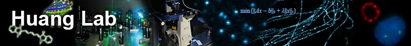
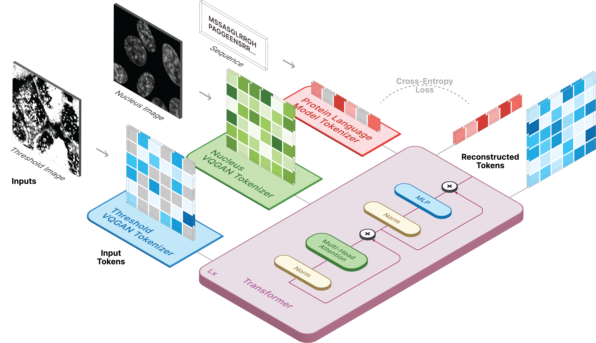
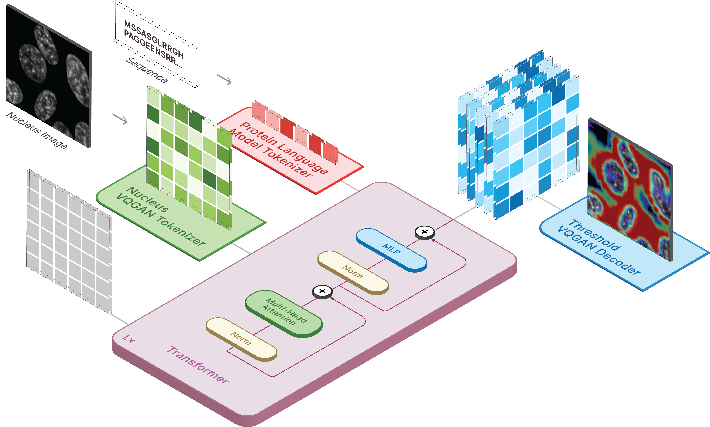

<p>
<center>

  </center>
</p>

# CELL-E 2: Translating Proteins to Pictures and Back with a Bidirectional Text-to-Image Transformer

This repository is the official implementation of [CELL-E 2: Translating Proteins to Pictures and Back with a Bidirectional Text-to-Image Transformer]([http://huanglab.ucsf.edu/celle-2/](https://bohuanglab.github.io/CELL-E_2/)). 




## Requirements

Create a virtual environment and install the required packages via:

```setup
pip install -r requirements.txt
```

Next, install ```torch = 2.0.0``` with the [appropriate CUDA version](https://pytorch.org/get-started/previous-versions/#v171) 

## Model Downloads
Models are available on [Hugging Face](https://huggingface.co/HuangLab).

We also have two spaces available where you can run predictions on your own data!

- [Image Prediction](https://huggingface.co/spaces/HuangLab/CELL-E_2-Image_Prediction)
- [Sequence Prediction](https://huggingface.co/spaces/HuangLab/CELL-E_2-Sequence_Prediction)

## Generating Images



To generate images, set the saved model as the ckpt_path. This method can be unstable, so refer to ```Demo.ipynb``` to see another way of loading.

```python
from omegaconf import OmegaConf
from celle_main import instantiate_from_config

configs = OmegaConf.load(configs/celle.yaml);

model = instantiate_from_config(configs.model).to(device);

model.sample(text=sequence,
                      condition=nucleus,
                      return_logits=True,
                      progress=True)
```

## Sequence Prediction
```python
model.sample_text(condition=nucleus,
                  image=image,
                  return_logits=True,
                  progress=True)
```

## Training

Training for CELL-E occurs in 3 stages:

- Training Protein Threshold Image Encoder
- Training a Nucleus Image Encoder
- Training CELL-E Transformer 

#### VQGANs
If using the protein threshold image, set ```threshold: True``` for the dataset.

We use a slightly modified version of the [taming-transformers](https://github.com/CompVis/taming-transformers) code.

To train, run the following script:

```python celle_taming_main.py --base configs/threshold_vqgan.yaml -t True```

Please refer to the original repo for additional flags, such as ```--gpus```. 

## Preparing Dataset

### Images

We provide scripts for downloading Human Protein Atlas and OpenCell images in the scripts folder. A ```data_csv``` is needed to for the dataloader. You must generate a csv file which contains the columns ```nucleus_image_path```, ```protein_image_path```, ```metadata_path```, ```split``` (train or val), and ```sequence``` (optional). It is assumed that this file exists within the the same general ```data``` folder as the images and metadata files.

### Metadata

Metadata is a JSON which should accompany every protein sequence. If a sequence does not appear in the ```data_csv```, it must appear in ```metadata.json``` with the a key named ```protein_sequence```.

Adding more information here can be useful for querying individual proteins. They can be retrieved via ```retrieve_metadata```, which creates a ```self.metadata``` variable within the dataset object.

To train, run the following script:

```python celle_main.py --base configs/celle.yaml -t True```

Specify ```--gpus``` in the same format as VQGAN.

CELL-E contains the following options:

- ```ckpt_path``` : Resume previous CELL-E 2 training. Saved model with state_dict
- ```vqgan_model_path``` : Saved protein image model (with state_dict) for protein image encoder 
- ```vqgan_config_path```: Saved protein image model yaml
- ```condition_model_path``` : Saved condition (nucleus) model (with state_dict) for protein image encoder 
- ```condition_config_path```: Saved condition (nucleus) model yaml
- ```num_images```: 1 if only using protein image encoder, 2 if including condition image encoder
- ```image_key```: ```nucleus```, ```target```, or ```threshold```
- ```dim```: Dimension of language model embedding
-  ```num_text_tokens```: total number of tokens in language model (33 for ESM-2)
-  ```text_seq_len```: Total number of amino acids considered
-  ```depth```: Transformer model depth, deeper is usually better at the cost of VRAM
-  ```heads```: number of heads used in multi-headed attention
- ```dim_head```: size of attention heads
- ```attn_dropout```: Attention Dropout rate in training
- ```ff_dropout```: Feed-Forward Dropout rate in training
- ```loss_img_weight```: Weighting applied to image reconstruction. text weight = 1
- ```loss_text_weight```: Weighting applied to condition image reconstruction.
- ```stable```: Norms weights (for when exploding gradients occur)
- ```learning_rate```: Learning rate for Adam optimizer
- ```monitor```: Param used to save models

## Citation

Please cite us if you decide to use our code for any part of your research.
```
@inproceedings{
anonymous2023translating,
title={CELL-E 2: Translating Proteins to Pictures and Back with a Bidirectional Text-to-Image Transformer},
author={Emaad Khwaja, Yun S. Song, Aaron Agarunov, and Bo Huang},
booktitle={Thirty-seventh Conference on Neural Information Processing Systems},
year={2023},
url={https://openreview.net/forum?id=YSMLVffl5u}
}
```
